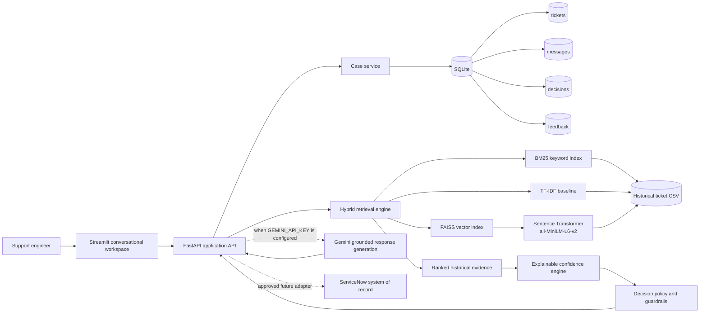
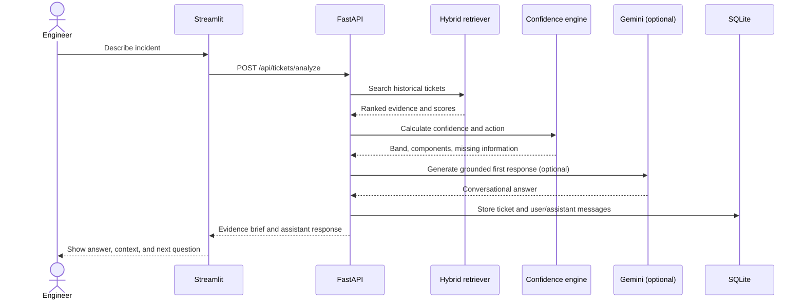

# RamGPT Architecture and Technical Design

This document describes the prototype architecture for the
`RamGPT_Ticket_Resolution_assignment`.

## 1. Design goals and boundaries

RamGPT is a decision-support copilot beside ServiceNow. It uses historical
resolved tickets to prepare evidence, a recommendation, and a useful human
handoff. It does not replace ServiceNow, autonomously close tickets, or move
ownership without a named human reviewer.

The pilot assumes:

- one department of approximately 20-50 people;
- a supplied CSV of historical tickets and resolutions;
- no live ServiceNow credentials or instance;
- local deployment for demonstration and evaluation;
- a single operator role (`Support Lead`) in the prototype.

## 2. High-level architecture



## 3. Runtime components

| Component | Responsibility | Prototype technology |
|---|---|---|
| Conversational UI | Ticket creation, chat, evidence, case memory, approval, feedback | Streamlit |
| Application API | Typed HTTP contracts and orchestration | FastAPI + Pydantic |
| Case store | Tickets, messages, decisions, feedback | SQLite |
| Semantic retrieval | Meaning-based nearest-neighbor search | Sentence Transformers + FAISS |
| Keyword retrieval | Exact terms, error codes, product names | BM25 |
| Lexical baseline | Explainable baseline and fallback retrieval | scikit-learn TF-IDF |
| Response generation | Grounded conversational explanation | Gemini, optional |
| Confidence policy | Deterministic recommendation and abstention | Python policy engine |
| Historical knowledge base | Resolved ticket evidence | `it_ticket_dataset.csv` |

## 4. Low-level request flow

### New ticket



### Follow-up conversation

1. The user sends a message to `POST /api/tickets/{id}/chat`.
2. The message is committed immediately to `messages`.
3. The complete current user conversation is used to build case context.
4. Hybrid retrieval runs again with the updated context.
5. Confidence and missing-information fields are recalculated.
6. Gemini receives the transcript, evidence, and policy instructions when
   configured; otherwise the grounded fallback responds.
7. The assistant response is committed in the same request.
8. The API returns both `user_message` and `assistant_message` so the UI can
   render the completed turn without relying on a delayed reload.

## 5. Retrieval design

The historical text is formed from:

```text
short_description + description + category + assignment_group
```

For each query, RamGPT computes:

- semantic similarity from normalized MiniLM embeddings and FAISS inner product;
- BM25 keyword relevance;
- TF-IDF cosine similarity.

The prototype blends these signals into one ranking score:

```text
ranking score =
    55% semantic similarity
  + 25% TF-IDF similarity
  + 20% normalized BM25 score
```

The UI labels the output as **Similarity**, not correctness. A retrieved
resolution is evidence for human review, not proof of the current root cause.

The FAISS index is built once and cached at
`.cache/historical_tickets.faiss`. The launcher waits for API readiness before
opening the UI, preventing a first-request timeout.

## 6. Confidence and decision policy

Confidence is intentionally independent from the retrieval score:

```text
confidence =
    50% top retrieval similarity
  + 30% agreement on the leading historical assignment group
  + 20% evidence quality in the current ticket
```

Policy bands:

| Band | Threshold | Behavior |
|---|---:|---|
| High | >= 80% | Prepare recommendation for human approval |
| Medium | 60-79% | Assisted review; show evidence and limitations |
| Low | < 60% | Abstain from a specific resolution; ask questions and prepare handoff |

Evidence quality currently checks for useful context such as an error/code,
start time, business impact, and affected-user scope. These checks are
transparent heuristics, not a claim that the ticket is factually correct.

## 7. Data model

### `tickets`

| Column | Meaning |
|---|---|
| `id` | RamGPT case identifier |
| `short_description`, `description` | Original ticket report |
| `category`, `assignment_group` | Proposed classification |
| `status` | Pending approval, approved, or rejected |
| `confidence`, `recommendation` | Latest policy result |
| `proposed_resolution` | Only populated when evidence clears the proposal guardrail |
| `created_at`, `updated_at` | Audit timestamps |

### `messages`

Stores the user and assistant conversation for each ticket:

```text
id, ticket_id, role, content, created_at
```

### `decisions`

Stores the human action and accountability fields:

```text
id, ticket_id, action, reviewer, comment, created_at
```

### `feedback`

Stores the learning signal and decision snapshot:

```text
rating, corrected_group, corrected_resolution, final_resolution,
recommendation_snapshot, confidence, retrieved_ticket_ids
```

## 8. API contract

| Method | Endpoint | Purpose |
|---|---|---|
| `GET` | `/api/health` | Check readiness and AI/retrieval mode |
| `POST` | `/api/tickets/analyze` | Create a case and initial evidence analysis |
| `GET` | `/api/tickets/{id}` | Reopen a case and its transcript |
| `GET` | `/api/tickets/{id}/analysis` | Recalculate analysis without creating a duplicate case |
| `POST` | `/api/tickets/{id}/chat` | Append a user turn, generate an answer, and re-analyze |
| `POST` | `/api/tickets/{id}/decision` | Record named human approval/rejection |
| `POST` | `/api/tickets/{id}/feedback` | Store rating, corrections, and final resolution |
| `GET` | `/api/evaluation` | Return reproducible retrieval proxy metrics and feedback counts |

## 9. Human-in-the-loop controls

RamGPT does not directly call ServiceNow in this pilot. The approval endpoint
only records the human decision and produces a handoff payload. A production
ServiceNow adapter would be placed after this boundary and would require:

- authenticated service identity;
- idempotency keys;
- explicit approved decision reference;
- audit correlation ID;
- retry and reconciliation handling.

## 10. Evaluation and observability

The evaluation page reports a 50-ticket leave-one-out proxy for assignment-group
retrieval:

- top-1 team accuracy;
- top-3 team coverage;
- correct, partially correct, and incorrect human feedback counts.

For a production pilot, add a human-labeled benchmark and track:

- grounded resolution accuracy;
- high-confidence precision;
- abstention rate;
- reviewer override rate;
- correct routing rate;
- time-to-resolution;
- Gemini failure/fallback rate;
- retrieval and confidence drift.

## 11. Failure behavior

- Missing Gemini key: use grounded deterministic fallback.
- Gemini API failure: log the failure and use fallback; do not return a
  success-shaped fabricated response.
- Weak historical evidence: abstain from a specific resolution.
- Missing ticket context: ask targeted requester questions.
- Missing or corrupt FAISS cache: rebuild atomically, never load a partial file.
- Human rejection: preserve the reason and route the case to triage.

## 12. Production evolution

If this pilot becomes a real service, the next steps are authentication and
RBAC, PostgreSQL, PII redaction, a managed vector store, model/version
registry, prompt/version tracking, ServiceNow webhooks, monitoring, a
human-labeled benchmark, and deployment behind HTTPS.
